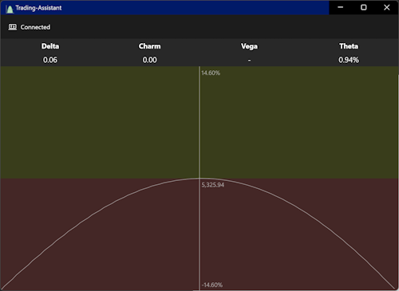

# Trading Assistant  

  

Trading Assistant is an application designed to provide a user-friendly interface for managing hedged portfolios with [Interactive Brokers (IBKR)](https://www.interactivebrokers.com/). Connecting via the IBKR [REST API](https://www.interactivebrokers.com/campus/ibkr-api-page/webapi-ref/), this tool empowers users to efficiently monitor and manage overall portfolio risk by visualizing real-time risk curves and key portfolio Greeks—including delta, charm, vega, and theta. By delivering real-time risk analytics in a clear format, Trading Assistant enables users to quickly assess their portfolio’s risk profile and make well-informed adjustments to maintain their desired level of risk exposure.

  

It is a modern Windows application built with .NET 9 and WinUI, designed to provide advanced trading functionalities by integrating with Interactive Brokers. The solution is modular, leveraging best practices in dependency injection, configuration, and logging, and is structured for maintainability and extensibility.

---

## Table of Contents

- [Features](#features)
- [Solution Structure](#solution-structure)
- [Getting Started](#getting-started)
- [Configuration](#configuration)
- [Logging](#logging)
- [Testing](#testing)
- [Contributing](#contributing)
- [License](#license)

---

## Features

- **WinUI Desktop Application**: Modern, responsive UI for Windows 10/11.
- **Interactive Brokers Integration**: Real-time trading, account management, and market data via IB Client Portal API.
- **Dependency Injection**: Built on `Microsoft.Extensions.DependencyInjection` for flexible service management.
- **Configuration**: Supports layered configuration via `appsettings.json` and user-specific overrides.
- **Structured Logging**: Uses Serilog for robust, rolling file logging.
- **Unit Testing**: MSTest-based tests for core logic.

---

## Solution Structure

The solution is organized into the following projects:

| Project                | Description                                                                 |
|------------------------|-----------------------------------------------------------------------------|
| **[App](https://github.com/petrochuk/Trading-Assistant/tree/main/src/App)**                | Main WinUI application, entry point, and DI setup.                          |
| **[AppCore](https://github.com/petrochuk/Trading-Assistant/tree/main/src/AppCore)**            | Core logic, shared utilities, and abstractions.                             |
| **[InteractiveBrokers](https://github.com/petrochuk/Trading-Assistant/tree/main/src/InteractiveBrokers)** | Integration layer for Interactive Brokers API (REST and WebSocket).         |
| **[AppCore.Tests](https://github.com/petrochuk/Trading-Assistant/tree/main/src/AppCore.Tests)**      | Unit tests for AppCore using MSTest.                                        |

---

## Getting Started

### Prerequisites

- **Windows 10/11** (minimum version 10.0.17763.0)
- **.NET 9 SDK**
- **Visual Studio 2022** (with .NET Desktop and WinUI workloads)

### Build & Run

**Clone the repository:**
```bash
git clone https://github.com/petrochuk/Trading-Assistant.git
```
**Open the solution in Visual Studio:**  

To run the application, press `F5` in Visual Studio or use the **Start** button.

## Feedback or Questions?

If you have any feedback or questions, please feel free to open an [issue on GitHub](../../issues), reach out to via [email](mailto:petrochuk@msn.com) or [Microsoft Teams](https://teams.live.com/meet/9327086431906?p=WhrNkghgaPHA3oNSiq).
